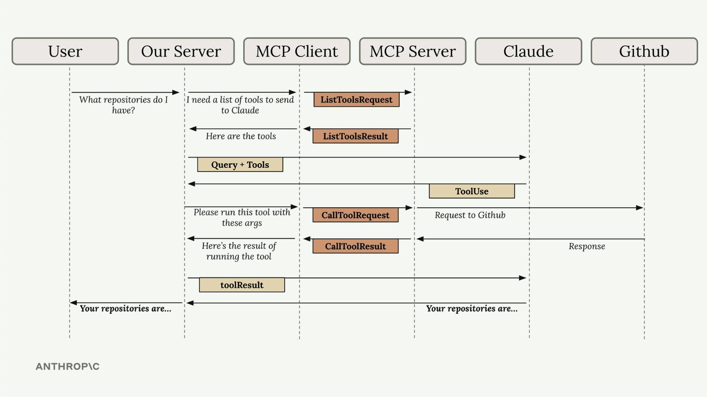
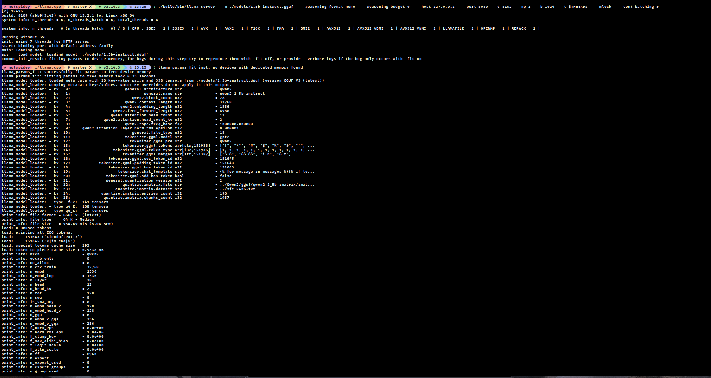
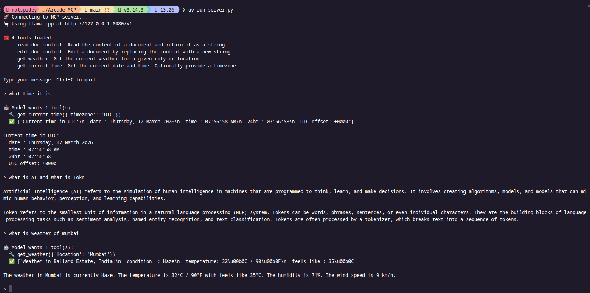
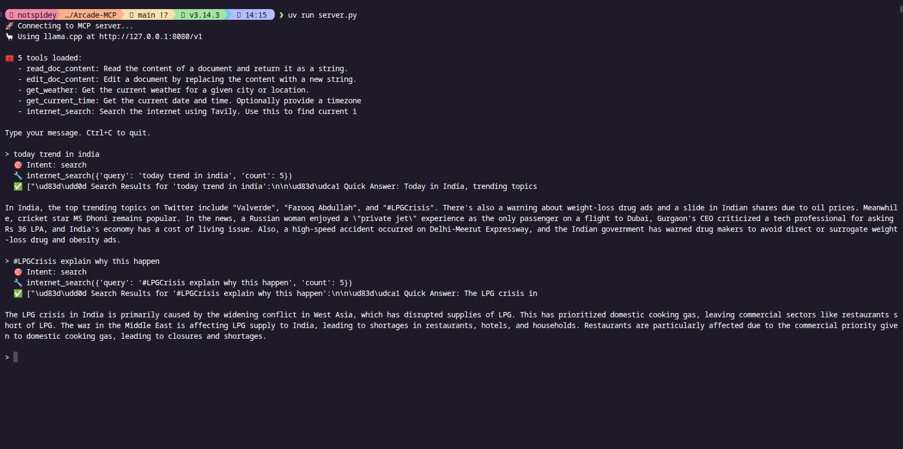

# Arcade-MCP

**Arcade-MCP** is a lightweight bridge that connects **llama.cpp server models** with **MCP tools**, enabling structured tool execution, progress tracking, and extensible local AI workflows.

---

## 🚀 Overview

Arcade-MCP enables a locally running `llama.cpp` model to interact with MCP-compatible tools through a simple and modular server interface.

This project is intended for:

* Local LLM tool orchestration
* Agent workflows powered by MCP
* High-performance lightweight inference setups
* Experimentation with tool-augmented reasoning

---

## 🏗️ Architecture

### Claude MCP Workflow (Official Diagram)



*Official Claude MCP architecture showing the complete message flow: User → Our Server → MCP Client → MCP Server → Claude → GitHub. This demonstrates how tool discovery (ListToolsRequest/Result), query processing (Query + Tools), tool execution (CallToolRequest/Result), and response synthesis work together in the MCP protocol.*

### Llama.cpp Server Running



*Llama.cpp server running locally on port 8080 with the GGUF model loaded, showing context window (8192 tokens), batch processing, continuous batching enabled, and multi-threaded inference. The server provides the `/v1/chat/completions` endpoint for MCP integration.*

### CLI Chat Interface



*Command-line interface showing real-time interaction with the MCP-powered agent. Users can query their GitHub repositories, file system, and other tools through natural language. The interface displays tool execution progress, results, and formatted responses.*

### Web Search Tool



### System Architecture Overview

```
┌─────────────────────────────────────────────────────────────────────────┐
│                          ARCADE-MCP SYSTEM                              │
├─────────────────────────────────────────────────────────────────────────┤
│                                                                         │
│  ┌──────────┐      ┌──────────────┐      ┌─────────────┐                │
│  │   User   │────▶│  Our Server  │────▶│ MCP Client  │                │
│  │   (CLI)  │      │   (Arcade)   │      │             │                │
│  └──────────┘      └──────────────┘      └─────────────┘                │
│                           │                      │                      │
│                           │                      ▼                      │
│                           │              ┌─────────────┐                │
│                           │              │ MCP Server  │                │
│                           │              │   (Tools)   │                │
│                           │              └─────────────┘                │
│                           │                      │                      │
│                           ▼                      │                      │
│                    ┌──────────────┐              │                      │
│                    │    Claude    │◀────────────┘                      │
│                    │  (llama.cpp) │                                     │
│                    │   Port 8080  │                                     │
│                    └──────────────┘                                     │
│                           │                                             │
│                           ▼                                             │
│                    ┌──────────────┐                                     │
│                    │   External   │                                     │
│                    │   Services   │                                     │
│                    │  (Weather,   │                                     │
│                    │   Time,      │                                     │
│                    │   Web(FS)    │                                     │
│                    └──────────────┘                                     │
└─────────────────────────────────────────────────────────────────────────┘
```

---

## 📊 Setting Up Architecture Diagrams

To display the architecture diagrams, you need to upload three images to your repository:

1. **Create a `docs/images/` directory** in your repository:
   ```bash
   mkdir -p docs/images
   ```

2. **Add the following screenshots/images**:
   - `claude-mcp-diagram.png` - The official Claude MCP workflow diagram (use the screenshot you provided)
   - `llama-server.png` - Screenshot of llama.cpp server running in terminal
   - `chat-cmd.png` - Screenshot of the CLI chat interface in action

3. **Capture the screenshots**:
   
   **For `llama-server.png`:**
   - Run the llama.cpp server with your model
   - Take a screenshot showing the server startup output, port binding, and model loading
   
   **For `chat-cmd.png`:**
   - Run your Arcade-MCP CLI chat interface
   - Interact with it (e.g., ask "What repositories do I have?")
   - Take a screenshot showing the conversation with tool execution

4. **Upload to GitHub**:
   ```bash
   git add docs/images/*.png
   git commit -m "Add architecture diagrams"
   git push
   ```

The images will automatically be displayed in the README at:
```
https://raw.githubusercontent.com/ProjectArcade/Arcade-MCP/main/docs/images/
```

---

## 🚀 Quick Start


### Installation Steps

1. **Clone and setup llama.cpp**:
   ```bash
   git clone https://github.com/ggerganov/llama.cpp
   cd llama.cpp
   make -j
   ```

2. **Clone Arcade-MCP**:
   ```bash
   git clone https://github.com/ProjectArcade/Arcade-MCP.git
   cd Arcade-MCP
   ```

3. **Install dependencies**:
   ```bash
   pip install -r requirements.txt
   # or
   uv pip install -r requirements.txt
   ```

4. **Download a model** and place it in `models/`:
   ```bash
   # Example: Download a small model
   wget https://huggingface.co/... -O models/1.5b-instruct.gguf
   ```

5. **Start llama.cpp server**:
   ```bash
   ./build/bin/llama-server -m ./models/1.5b-instruct.gguf --port 8080
   ```

6. **Start Arcade-MCP** (in a new terminal):
   ```bash
   python server.py
   ```

7. **Start chatting!** The CLI will prompt you for input.

---

## 📦 Requirements

* Linux or macOS (WSL supported)
* `llama.cpp` compiled with the server binary
* GGUF model file
* Python runtime (for Arcade-MCP server)
* Configured MCP tools

---

## 🧠 Model Setup

Place your GGUF model inside the `models/` directory.

Example:

```
models/1.5b-instruct.gguf
```

---

## ⚙️ Start the llama.cpp Server

Run the following command to start the local inference server:

```bash
THREADS=$(($(nproc)-2))
if [ "$THREADS" -lt 2 ]; then THREADS=2; fi

./build/bin/llama-server \
  -m ./models/1.5b-instruct.gguf \
  --reasoning-format none \
  --reasoning-budget 0 \
  --host 127.0.0.1 \
  --port 8080 \
  -c 8192 \
  -np 2 \
  -b 1024 \
  -t $THREADS \
  --mlock \
  --cont-batching &
```

### Parameter Notes

* `-m` — Path to the GGUF model
* `--host`, `--port` — Server binding configuration
* `-c` — Context length (8192 tokens)
* `-np` — Number of parallel sequences
* `-b` — Batch size
* `-t` — CPU thread count (auto-calculated)
* `--mlock` — Prevent model memory from being swapped
* `--cont-batching` — Enables continuous batching for improved throughput

---

## 🔌 Start the Arcade-MCP Server

Run the MCP bridge server:

```bash
python server.py
```

Or:

```bash
uv run server.py
```

The server will:

* Connect to the local `llama.cpp` API endpoint (`http://127.0.0.1:8080`)
* Load configured MCP tools
* Enable structured tool execution workflows
* Initialize session management
* Set up request/response pipeline

---


## 🌐 Access

* LLM Server API → `http://127.0.0.1:8080`
* Arcade-MCP Interface → CLI (UI support planned)

---

## 🔄 Workflow Example

### GitHub Repository Query

1. **User Input**: "What repositories do I have?"
2. **Server Processing**: Receives query, initializes MCP client
3. **Tool Discovery**: MCP client requests available tools from MCP server
4. **Claude Analysis**: Query + tools sent to llama.cpp model
5. **Tool Selection**: Claude responds with `ToolUse` for `github_list_repos`
6. **Tool Execution**: MCP client calls MCP server → GitHub API
7. **Result Processing**: GitHub data returned through chain
8. **Response Synthesis**: Claude formats final human-readable response
9. **User Output**: "Your repositories are: arcade-mcp, studybuddy, ..."

---

## ✨ Features

* **Fully local inference** (no cloud dependency)
* **MCP tool execution pipeline** with structured communication
* **Streaming progress support** for real-time feedback
* **Modular and extensible architecture** for easy tool addition
* **Compatible with small and large GGUF models** (tested with 1.5B-70B+)
* **Continuous batching** for improved performance
* **Multi-threaded inference** utilizing available CPU cores
* **Session management** for conversation continuity
* **Error handling and recovery** at each layer
* **Tool-aware prompting** for accurate function calling

---

## 🔄 MCP Workflow Example

Here's what happens when you ask "What repositories do I have?":

```
┌─────────────────────────────────────────────────────────────────────────┐
│                        Message Flow Timeline                            │
└─────────────────────────────────────────────────────────────────────────┘

1. USER INPUT
   You: "What repositories do I have?"
        ↓

2. SERVER PROCESSING
   Arcade Server receives query
   → Initializes MCP Client
        ↓

3. TOOL DISCOVERY
   MCP Client ──[ListToolsRequest]──▶ MCP Server
   MCP Server ──[ListToolsResult]───▶ MCP Client
   
   Available tools:
   ✓ github_list_repos
   ✓ github_get_file
   ✓ filesystem_read
        ↓

4. QUERY TO CLAUDE
   Server ──[Query + Available Tools]──▶ llama.cpp
        ↓

5. TOOL SELECTION
   llama.cpp analyzes query
   → Determines: Need to call github_list_repos
   llama.cpp ──[ToolUse: github_list_repos]──▶ Server
        ↓

6. TOOL EXECUTION
   Server ──[CallToolRequest]──▶ MCP Server
   MCP Server ──[GitHub API Call]──▶ GitHub
   GitHub ──[Repository Data]──▶ MCP Server
   MCP Server ──[CallToolResult]──▶ Server
        ↓

7. RESPONSE SYNTHESIS
   Server ──[ToolResult Data]──▶ llama.cpp
   llama.cpp formats human-readable response
        ↓

8. USER OUTPUT
   Agent: "Your repositories are:
          • arcade-mcp - MCP integration for llama.cpp
          • studybuddy - AI-powered study platform
          • lykon - Custom web browser"
```


## 🛠 Development

### Build llama.cpp

```bash
git clone https://github.com/ggerganov/llama.cpp
cd llama.cpp
make -j
```

### Install Python Dependencies

```bash
pip install -r requirements.txt
```

Or using `uv`:

```bash
uv pip install -r requirements.txt
```


### Core Modules

**`core/chat.py`** - Chat session management and conversation handling
- Manages conversation history
- Handles user input/output formatting
- Session state management

**`core/claude.py`** - Integration with llama.cpp LLM
- API communication with llama.cpp server
- Request/response handling
- Context window management

**`core/mcp_chat.py`** - MCP-specific chat interface
- Bridges chat with MCP protocol
- Tool call orchestration
- Response synthesis

**`core/cli.py`** - Command-line interface
- User interaction loop
- Pretty printing and formatting
- Progress indicators

**`core/tools.py`** - Tool definitions
- Tool registration
- Input schema validation
- Execution handlers

### Main Files

**`server.py`** - Application entry point
- Initializes all components
- Starts the CLI interface
- Handles graceful shutdown

**`mcp_client.py`** - MCP client
- Connects to MCP servers
- Tool discovery (ListToolsRequest/Result)
- Tool execution (CallToolRequest/Result)

**`mcp_server.py`** - MCP server
- Registers available tools
- Handles tool execution requests
- Returns results to client


---

## 📄 License

MIT License


## 🤝 Contributing

Contributions are welcome!
Please open an issue to discuss major changes before submitting a pull request.

### Development Guidelines

1. Follow MCP specification for tool implementations
2. Add comprehensive error handling
3. Include docstrings and type hints
4. Test with multiple model sizes
5. Update documentation for new features

---


## ⭐ Vision

Arcade-MCP aims to provide a robust foundation for building **local AI agents with tool access**, supporting experimentation, research, and production-grade workflows on consumer hardware.

By combining the efficiency of `llama.cpp` with the extensibility of MCP, we enable:
* **Privacy-first AI** - All processing happens locally
* **Cost-effective deployment** - No API costs
* **Customizable workflows** - Build tools for your specific needs
* **Research-friendly** - Experiment with agent architectures
* **Production-ready** - Scalable and reliable for real applications

---

## ❓ Troubleshooting & FAQ

### Common Issues

**Q: llama.cpp server fails to start**
```bash
# Check if port 8080 is already in use
lsof -i :8080

# Kill existing process
kill -9 <PID>

# Or use a different port
./llama-server -m model.gguf --port 8081
```

**Q: "Connection refused" when starting Arcade-MCP**
- Ensure llama.cpp server is running first
- Check that port 8080 is accessible: `curl http://127.0.0.1:8080`
- Verify firewall settings aren't blocking local connections

**Q: Model is too slow / high CPU usage**
```bash
# Reduce thread count
-t 4  # Use only 4 threads instead of auto-detection

# Reduce context length
-c 4096  # Instead of 8192

# Disable mlock if low on RAM
# Remove --mlock flag
```

**Q: MCP tools not being discovered**
- Check `tools/` directory exists and contains Python files
- Verify each tool follows MCP specification
- Check server logs for tool registration errors

**Q: "Out of memory" errors**
- Use a smaller model (1.5B instead of 7B)
- Reduce batch size: `-b 512`
- Reduce context length: `-c 2048`
- Enable memory locking: `--mlock`

### Performance Optimization

**For CPU-only inference:**
```bash
# Optimize thread count (typically cores - 2)
THREADS=$(($(nproc)-2))

# Enable BLAS for faster matrix ops (if available)
make LLAMA_BLAS=1

# Use Q4 or Q5 quantized models for speed
```

**For better response quality:**
```bash
# Increase context length
-c 16384

# Increase batch size (if RAM allows)
-b 2048

# Use higher quality model quantization (Q6, Q8)
```

### Debug Mode

Enable verbose logging:
```bash
# For llama.cpp
./llama-server --log-level DEBUG

# For Arcade-MCP
export LOG_LEVEL=DEBUG
python server.py
```

---

## 📞 Support

For issues and questions:
* Open a GitHub issue
* Check existing documentation
* Review MCP specification at [modelcontextprotocol.io](https://modelcontextprotocol.io)

---

**Built with ❤️ for the local AI community**